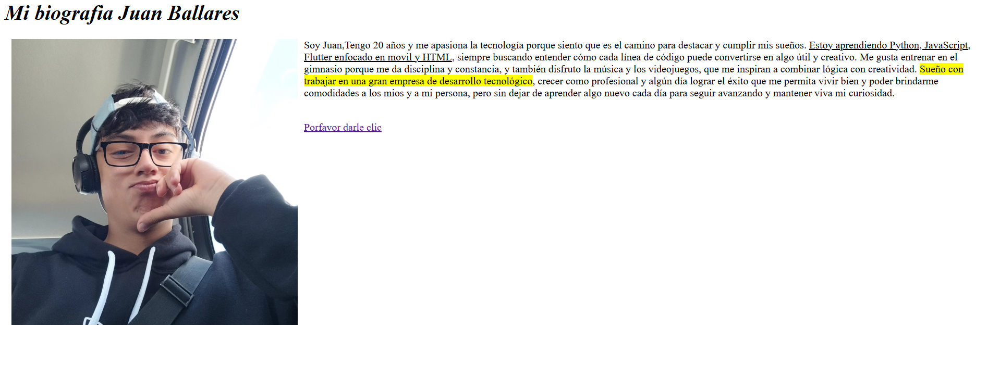

# Day 1 – HTML Project: "My Biography"

## 📌 Description
This project was built as part of my Full Stack Developer learning path.  
It represents my first contact with pure HTML, focusing on the basic structure of a web document, text formatting, images, nested tags, and internal/external links.  
The final project integrates all these concepts into a small personal website.

## 🚀 Features
- Main page with personal photo, name, and formatted biography text (italic, underline, highlight).
- Second page dedicated to my pet **Lucky the cat**, including an image.
- Internal navigation: links between both pages (go and return).
- Use of image attributes: `src`, `alt`, `height`, `align`, `hspace`.

## 🛠️ Technologies
- HTML5 (no CSS or JavaScript yet)

## 📷 Screenshots


## ▶️ How to Run
1. Clone the repository:
   ```bash
   git clone https://github.com/JuanBallares03/ProyectosJavaScript.git

