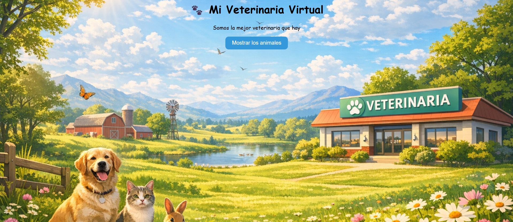
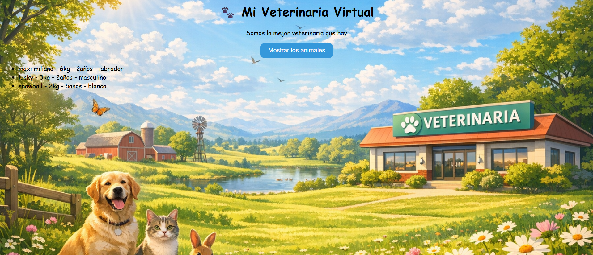

# 🐾 Day 10 – JavaScript Project: "Mi Veterinaria Virtual"

## 📌 Description
This project is an animal catalog built using **JavaScript ES6 classes with inheritance**.  
It focuses on object-oriented programming concepts: defining classes, using constructors, extending classes with `extends`, calling the parent constructor with `super`, and overriding methods (basic polymorphism).

---

## ✨ Features
- Base class **Animal** with properties: `nombre`, `peso`, `edad`.
- Subclasses:
  - **Perro** → extra property: `raza`.
  - **Gato** → extra property: `sexo`.
  - **Conejo** → extra property: `color`.
- Method `informacion()` overridden in each subclass using `super`.
- Dynamic rendering of the animal list in the DOM when pressing a button.
- Background image styled with CSS `cover`.
- Button with hover animation effect.

---

## 🛠 Technologies
- **HTML5**  
- **CSS3**  
- **JavaScript (ES6 Classes)**

---

## 🖼 Screenshots
### Animal Catalog Interface


### Animal Example


---
## 📌 Visual Disclaimer
The images used in this project were generated with artificial intelligence for decorative purposes. They do not represent registered trademarks and are not associated with any real company.

## 🚀 How to Run
1. Clone the repository:
   ```bash
   git clone https://github.com/JuanBallares03/ProyectosJavaScript.git
