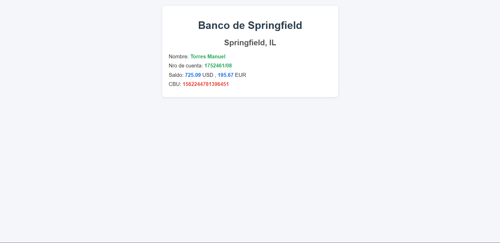

# Day 11 – JavaScript Project: "Springfield Bank"

## 📌 Description
This project is a banking account summary loaded from an external JSON file.  
It focuses on learning JSON (JavaScript Object Notation), how to read it with `fetch`, handle promises with `.then()`, and capture errors with `.catch()`.  
It’s the first project working with external data instead of hardcoded values.

## ✨ Features
- Automatic JSON loading when the page opens (`onload`).
- Reads `resumen.json` using `fetch`.
- Displays account holder, account number, CBU, and balance in two currencies (USD and EUR).
- Accesses nested arrays inside the JSON (`saldo[0]`, `saldo[1]`).
- Error handling with `.catch()`.

## 🛠 Technologies
- HTML5  
- CSS3  
- JavaScript  
- JSON

## 🖼 Screenshots
### Springfield Bank Summary


## 🚀 How to Run
1. Clone the repository:
```bash
git clone https://github.com/JuanBallares03/ProyectosJavaScript.git