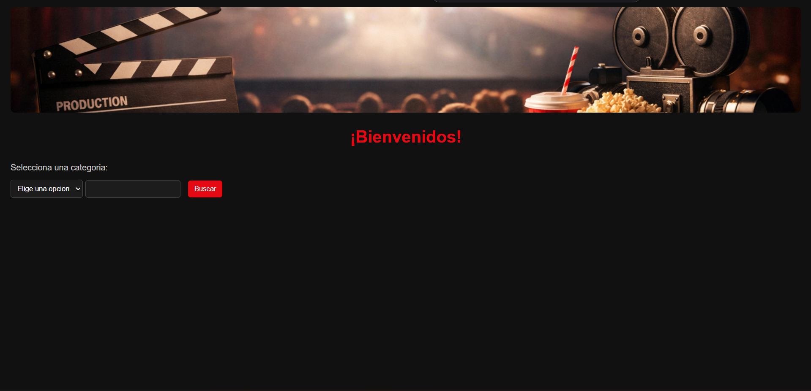
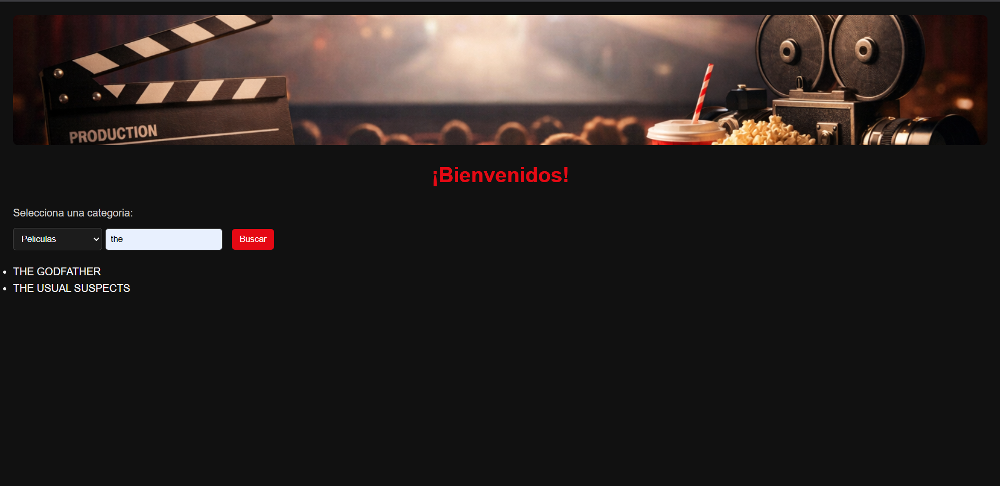

# Day 12 – JavaScript Project: "Movie & Series Finder"

## 📌 Description
This project is a movie and series search app that uses multiple JavaScript events.  
It focuses on handling keyboard, mouse, change, click, and custom events, as well as real-time validation and dynamic DOM updates.

## ✨ Features
- Category selector that dynamically loads the corresponding JSON (movies or series).
- Custom event `cambioArchivoBase` triggered when changing category.
- Search input with real-time validation: only letters allowed (blocks numbers and special characters with `preventDefault`).
- Search by title using `startsWith`.
- Dynamic list of results; when hovering over a title, its synopsis is displayed, and hidden when the mouse leaves.

## 🛠 Technologies
- HTML5  
- CSS3  
- JavaScript  
- JSON  
- Fetch API

## 🖼 Screenshots
### Movie & Series Finder Interface


### Movie Search Example


### Series Search Example


## 📌 Visual Disclaimer
The images used in this project were generated with artificial intelligence for decorative purposes. They do not represent registered trademarks and are not associated with any real company.

## 🚀 How to Run
1. Clone the repository:
```bash
git clone https://github.com/JuanBallares03/ProyectosJavaScript.git