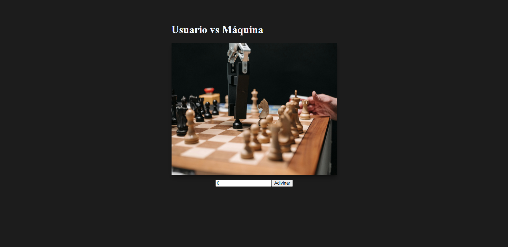

# Day 14 – JavaScript Project: "User vs Machine"

## 📌 Description
This project introduced the main tools of the modern JavaScript ecosystem: React, Angular, jQuery, and Axios, all explored superficially as a first contact.  
The practical project of the day consisted of building a single-page application (SPA) with React, applying the basic concepts of components, props, and state (hooks).

## ✨ Features
- **Title Component**: Displays the game name and a decorative image.  
- **UserInteraction Component**: Receives props `min` and `max` to define the game range.  
- Random number generation by the machine at app start, using `useState` with a function initializer.  
- Numeric input field where the user enters their number.  
- **"Guess" Button**: Compares the user's number with the machine's number.  
- Decision displayed indicating whether the user or the machine won.  
- When the machine wins, a new random number is automatically generated to restart the round.  
- Application organized as a SPA rendered from `main.jsx`.

## 🛠 Technologies
- React 19  
- React DOM  
- Vite (bundler and dev server)  
- JSX  
- ESLint  

## 🖼 Screenshots
### "User vs Machine" Interface


## 📌 Visual Disclaimer
- The favicon used in this project was sourced from [Flaticon](https://www.flaticon.es/iconos-gratis/videojuegos).  
- The chess image was sourced from [Pexels](https://www.pexels.com/es-es/foto/hombre-mano-tecnologia-investigacion-8438943/).  
- These resources are used for decorative purposes only. They do not represent registered trademarks and are not associated with any real company.

## 🚀 How to Run
Open the project with Vite and run the development server:
```bash
npm install
npm run dev

