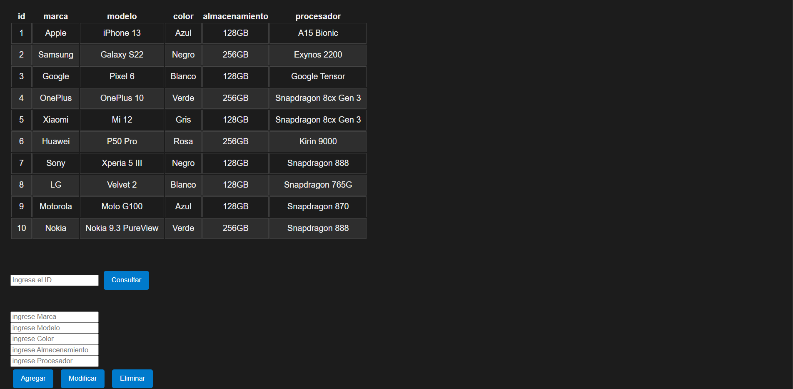

# Day 15 – JavaScript Project: "Phone Store – CRUD with Fetch API"

## 📌 Description
This project focused on learning how to communicate with external servers using HTTP methods (GET, POST, PUT, PATCH, DELETE) through the native JavaScript Fetch API.  
Key concepts practiced include the use of `async/await`, error handling with `try/catch`, HTTP headers, authentication (Basic and Bearer Token), cache types, redirect handling, and Axios interceptors.  
The integrative project applies all these concepts in an interface to consult, add, modify, and delete mobile device records by consuming an external REST API.

## ✨ Features
- Automatic loading of all devices on page load (`onload`) via a GET request, rendering data in a dynamic HTML table.  
- Query a device by ID entered in an input, displaying editable fields in textareas.  
- Add a new device to the API via a POST request with form data.  
- Modify an existing device via a PUT request, using data from editable textareas.  
- Delete a device from the API via a DELETE request using the queried record ID.  
- Error handling in each request with `try/catch` and console messages.  
- Use of `async/await` in all server communication functions.  
- Complementary exercises: PUT, DELETE, and PATCH with `.then()`/`.catch()`.  
- Advanced Fetch exercises: Basic authentication (base64), Bearer Token, cache configuration, credentials, and redirect handling.  
- Axios exercises: request and response interceptors, and multiple parallel requests with `Promise.all()`.

## 🛠 Technologies
- HTML5  
- CSS3  
- JavaScript (ES6+)  
- Fetch API (native browser)  
- Axios (HTTP library)  
- JSON Server (`my-json-server.typicode.com`) as simulated REST API  
- JSONPlaceholder (test API used in exercises)  

## 🖼 Screenshots
### "Phone Store" CRUD Interface


## 📌 Visual Disclaimer
The images used in this project were sourced from free resources for decorative purposes only.  
They do not represent registered trademarks and are not associated with any real company.

## 🚀 How to Run
Open the project in your browser:
```bash
# Clone the repository or open the project folder
cd dia15-comunicacion-servidor/05-proyecto-dia15

# Run with a local server (e.g., Live Server in VS Code)
