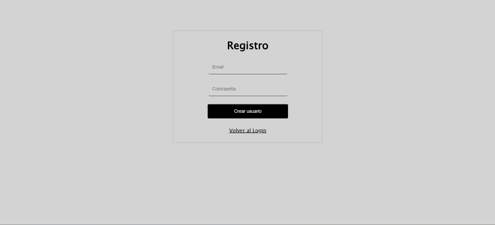
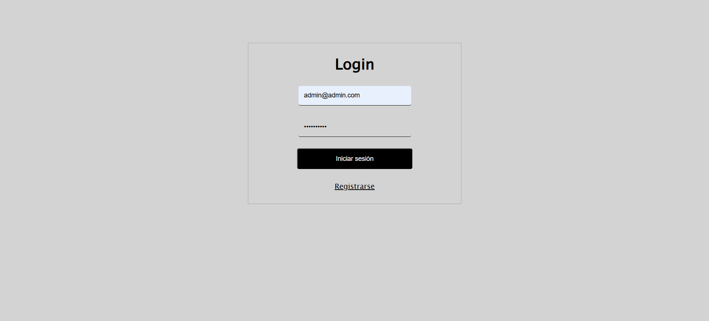
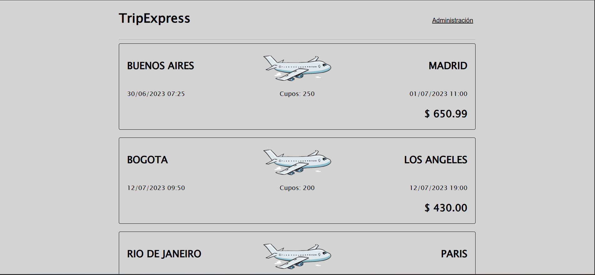
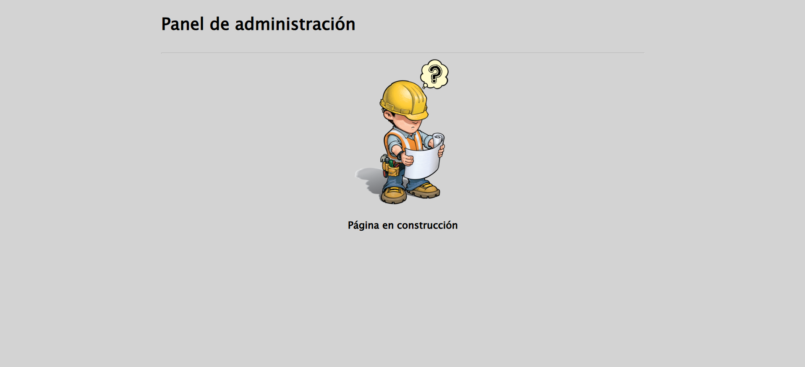

# Day 17 – JavaScript Project: "TripExpress – Secure REST API"

## 📌 Description
This project focused on implementing security in a REST API by applying password hashing with **bcrypt**, symmetric encryption of sensitive data with **crypto (AES-128-GCM)**, and token-based authentication with **JWT**.  
Additionally, password validation with regular expressions and a user permission system were implemented to control access to protected pages.

## ✨ Features
- **User Login**: authentication with encrypted email (AES-128-GCM) and hashed password (bcrypt); administrators authenticate with plain text credentials.  
- **User Registration**: account creation with encrypted email and hashed password, automatically assigning default permissions (`permiso_id = 2`).  
- **Password Validation (Registration)**: must contain at least one uppercase letter, one lowercase letter, and one number.  
- **Password Validation (Login)**: only allows letters and numbers (no special characters).  
- **JWT Token Generation**: created at login with 1-hour expiration, including user ID and name.  
- **JWT Token Validation**: middleware verifies the token in the `Authorization` header before accessing protected routes.  
- **Permission System**: verifies user permissions to redirect to the appropriate page based on role.  
- **Travel Offers Listing**: GET endpoint that queries and returns all offers from the database.  
- **Dynamic Rendering of Offers (Frontend)**: displays origin, destination, departure date, arrival date, available seats, and price.  
- **Protected Redirection to Admin Panel**: accessible only if the user has the corresponding permission.  

## 🛠 Technologies
- Node.js  
- Express.js  
- MySQL / MySQL2  
- bcrypt  
- crypto (Node.js native)  
- jsonwebtoken (JWT)  
- HTML, CSS, JavaScript (Vanilla)  
- Fetch API  

## 🖼 Screenshots
### "TripExpress" Secure API Interfaces
- **User Registration**  


- **User Login**  


- **Travel Offers (Sales)**  


- **Admin Panel**  


## 📌 Visual Disclaimer
The images used in this project were sourced from free resources for decorative purposes only.  
They do not represent registered trademarks and are not associated with any real company.

## 🚀 How to Run
Open the project in your terminal:
```bash
# Navigate to the project folder
cd 07-proyecto-dia17/api

# Install dependencies
npm install

# Run the server
node index.js
