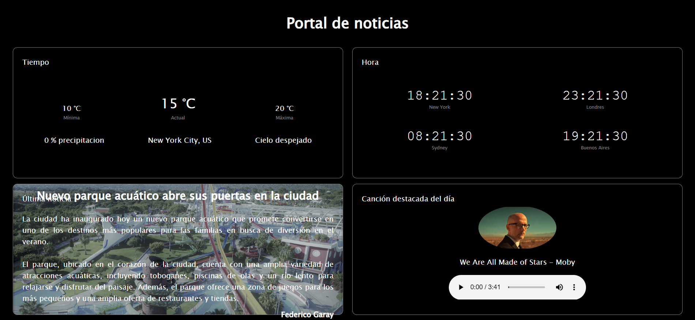

# Day 18 – JavaScript Project: "News Portal YA! – JS Modules"

## 📌 Description
This project focused on learning the JavaScript module system (`export`/`import`) to reduce global scope pollution and enable code reuse.  
It also introduced **NPM** for package management (including MongoDB connection) and the advantages of **strict mode** (`"use strict"`) for detecting common JavaScript errors.  
The integrative project applied these concepts in a news portal that consumes external APIs (weather, world time) and a local JSON file (featured news), as well as reproducing an audio file.

## ✨ Features
- **01-modulos**: example of exporting and importing functions between JS files using `export/import`.  
- **03-npm**: installation and usage of an NPM package (`mongodb`) to connect to a database.  
- **04-uso-estricto**: examples of JavaScript strict mode (`"use strict"`) showing errors with duplicate parameters, property deletion, etc.  
- **05-proyecto-base (News Portal)**:  
  - Weather API (Weatherbit): current weather (min, current, max temperature, precipitation, description) with default values if request fails.  
  - World Time API (Intl/Date): current time in New York, London, Sydney, and Buenos Aires.  
  - Local JSON: loads the latest featured news including image, title, content, and author.  
  - Audio element: plays the featured song of the day.  
  - Modular structure using `import/export` between `index.js`, `cargar-datos.js`, and `solicitudes.js`.  

## 🛠 Technologies
- JavaScript (ES Modules: `export/import`)  
- NPM (package management, e.g. `mongodb`, `bideo`)  
- HTML5 / CSS3  
- Fetch API  
- Weatherbit API (weather data)  
- Intl/Date API (time zones)  
- Local JSON  

## 🖼 Screenshots
### "News Portal YA!" Home


## 📌 Visual Disclaimer
The images used in this project were sourced from free resources for decorative purposes only.  
They do not represent registered trademarks and are not associated with any real company.

## 🚀 How to Run
Open the project in your terminal:
```bash
# Navigate to the project folder
cd dia18-modulos-budling/05-proyecto-base

# Install dependencies
npm install

# Open index.html in your browser
