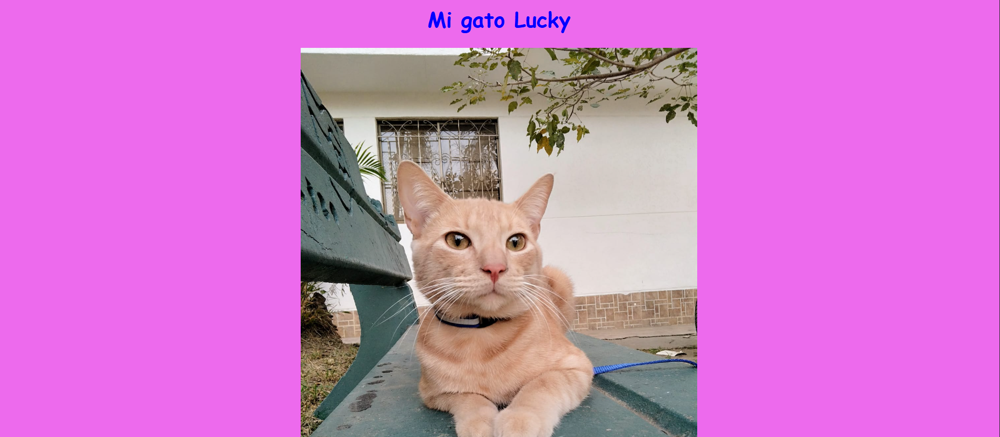
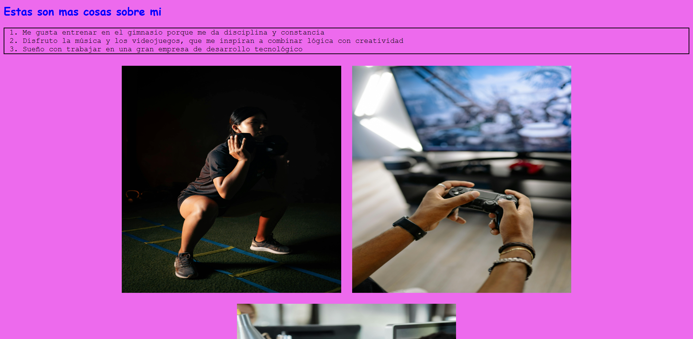

# Day 2 – CSS Project: "My Biography with Style"

## 📌 Description

This project is the improved version of Day 1, introducing **CSS styling** to enhance the visual design.  
It focuses on applying styles through type, class, ID, attribute selectors, pseudo-classes, pseudo-elements, and combinators.

## ✨ Features

- Custom background color and section-specific typography/colors.
- Responsive image with percentage-based width.
- Hover effect on links for interactive navigation.
- Enlarged first letter using `::first-letter`.
- Three interconnected pages with navigation links.

## 🛠 Technologies

- HTML5
- CSS3

## 🖼 Screenshots

### Main Page


### Pet Page


### Styled Biography


## 📷 Image Credits
All images used in this project are from [Pexels](https://www.pexels.com) and are free to use under the Pexels License.


## 🚀 How to Run

1. Clone the repository:

```bash
git clone https://github.com/JuanBallares03/ProyectosJavaScript.git
```
