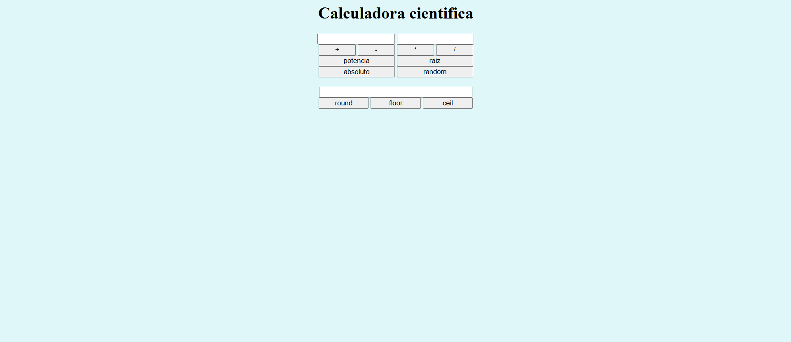
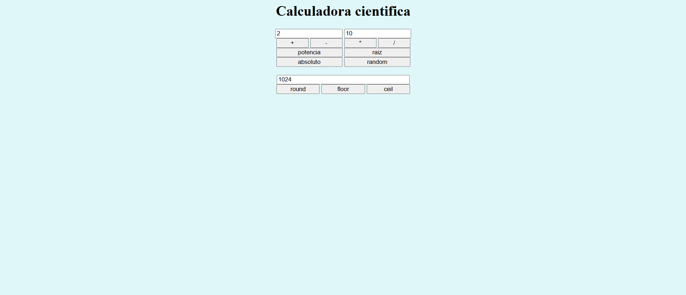

# Day 4 – JavaScript Project: "Scientific Calculator"

## 📌 Description
This project is an interactive scientific calculator built with JavaScript functions.  
It focuses on declaring functions, using parameters, return values, the `Math` object, random numbers, and arrow functions.  
The script is separated into an external file for better organization.

## ✨ Features
- Basic operations: addition, subtraction, multiplication, division.
- Advanced operations: power, square root, absolute value.
- Random number generation within a given range.
- Rounding methods: `Math.round`, `Math.floor`, `Math.ceil`.

## 🛠 Technologies
- HTML5  
- CSS3  
- JavaScript

## 🖼 Screenshots
### Calculator Interface


### Advanced Operations


## 🚀 How to Run
1. Clone the repository:
```bash
git clone https://github.com/JuanBallares03/ProyectosJavaScript.git