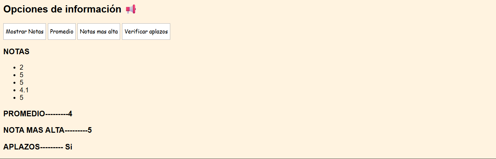

# Day 6 – JavaScript Project: "Grade Report"

## 📌 Description
This project is a grade viewer for a student, including statistics calculated with different loop structures.  
It focuses on practicing loops in JavaScript: `for`, `while`, `do-while`, `for...of`, as well as `break` and `continue`, applied to arrays.

## ✨ Features
- Display a dynamic list of grades in the DOM.
- Calculate average using `for`.
- Find the highest grade using `while`.
- Detect failing grades using `do-while`.

## 🛠 Technologies
- HTML5  
- CSS3  
- JavaScript

## 🖼 Screenshots
### Grade Report Interface!


### Statistics Example


## 🚀 How to Run
1. Clone the repository:
```bash
git clone https://github.com/JuanBallares03/ProyectosJavaScript.git