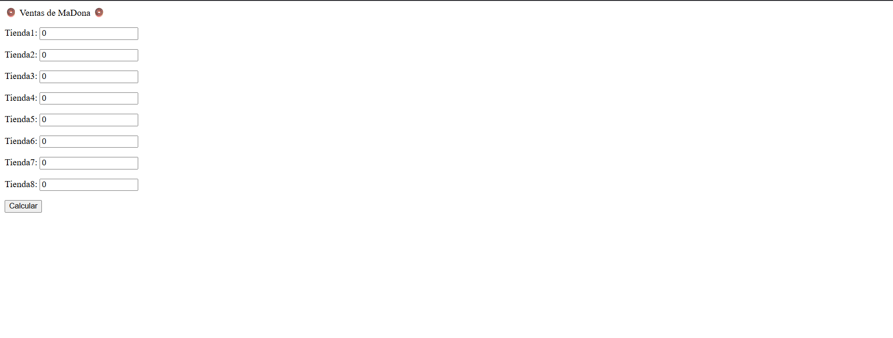
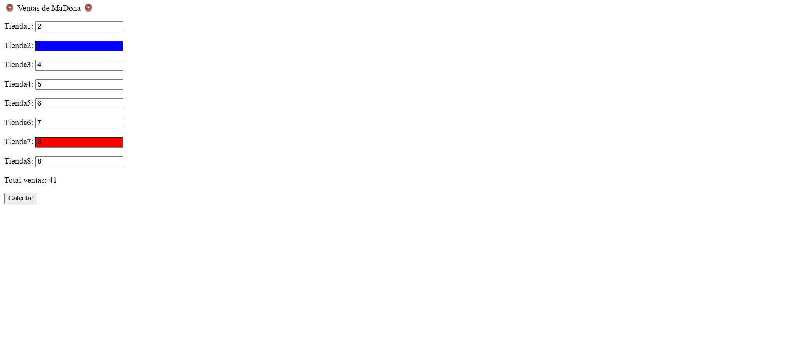

# Day 7 – JavaScript Project: "Donut Sales System"

## 📌 Description
This project is a sales registration system for 8 donut shops, generated automatically through DOM manipulation.  
It focuses on automating HTML creation with JavaScript using `createElement`, `appendChild`, and `setAttribute`, without manually writing the elements in the HTML file.

## ✨ Features
- Automatically generates 8 input fields for stores when the page loads.
- Calculates the total sales across all stores.
- Highlights the store with the highest and lowest sales.
- Includes both the student's own solution and the tutor's solution.

## 🛠 Technologies
- HTML5  
- JavaScript (no external CSS)

## 🖼 Screenshots
### Donut Sales Interface


### Highlighted Results


## 🚀 How to Run
1. Clone the repository:
```bash
git clone https://github.com/JuanBallares03/ProyectosJavaScript.git
