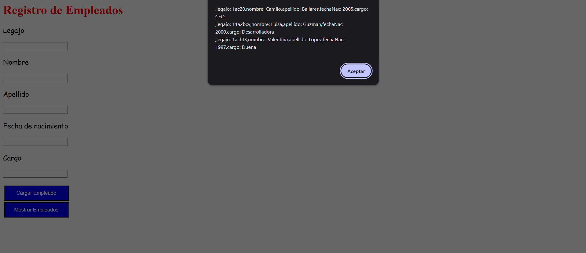

# Day 8 – JavaScript Project: "Employee Registry"

## 📌 Description
This project is an employee registration form that creates and lists employees using object constructors.  
It focuses on object-oriented programming in JavaScript: creating and modifying object literals, using `this`, constructors, and iterating with `for...in`.

## ✨ Features
- Form with fields: employee ID, first name, last name, birth date, and position.
- Creates instances of `CrearEmpleado` using `new`.
- Stores employees in an array.
- Displays all registered employees with `alert`.
- Automatically clears the form after each submission.

## 🛠 Technologies
- HTML5  
- CSS3  
- JavaScript

## 🖼 Screenshots
### Employee Registry Form


### Registered Employees Example


## 🚀 How to Run
1. Clone the repository:
```bash
git clone https://github.com/JuanBallares03/ProyectosJavaScript.git
