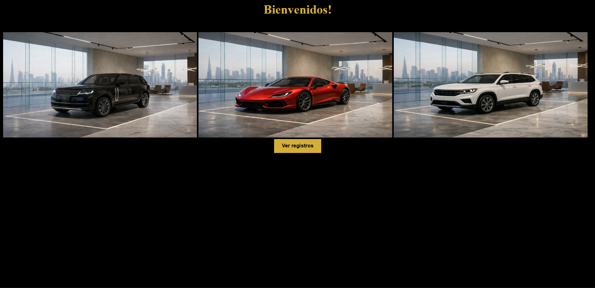

# Day 9 – JavaScript Project: "Vehicle Registry"

## 📌 Description
This project is a vehicle catalog built using JavaScript prototypes.  
It focuses on prototypes and inheritance, adding shared methods to constructors via `prototype`, allowing all instances to inherit them.

## ✨ Features
- Constructor `CrearAuto` with properties: brand, model, color, year, and owner.
- Prototypical methods: `verAuto()`, `venderAutomovil()`, `encender()`.
- 3 pre-registered cars displayed dynamically as a list in the DOM.
- Vehicle images included for each entry.

## 🛠 Technologies
- HTML5  
- CSS3  
- JavaScript

## 🖼 Screenshots
### Vehicle Registry Interface


### Vehicle Example

 
## 📌 Visual Disclaimer
The images used in this project were generated with artificial intelligence for decorative purposes. They do not represent registered trademarks and are not associated with any real company.

## 🚀 How to Run
1. Clone the repository:
```bash
git clone https://github.com/JuanBallares03/ProyectosJavaScript.git
